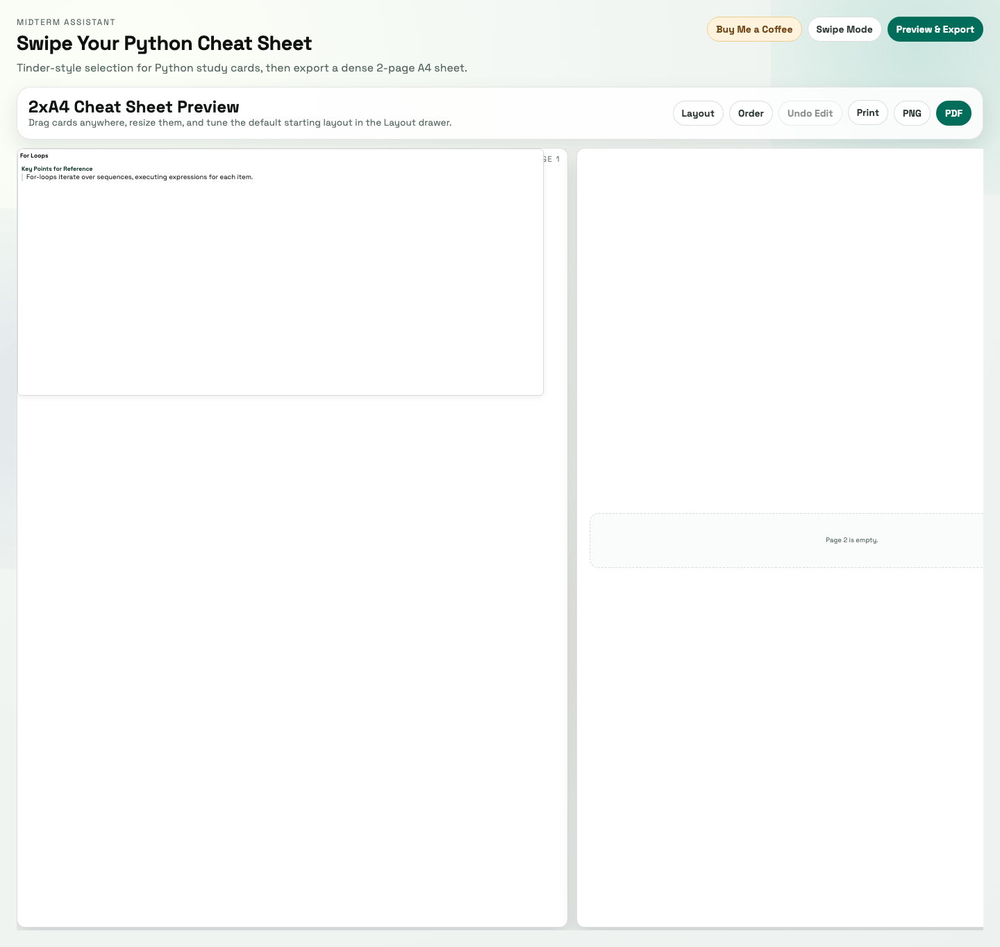

# Python Exam Cheat Sheet Web App

This app helps students in the Intro to Python course build a focused, printable cheat sheet from real course/exam topics.

## Current Content Snapshot

- Total topic cards: `28`
- Exam-topic cards in default deck: `21`
- Exam-topic key points: `198`
- Key points with optional detail blocks: `198`
- Optional detail blocks (examples/tables/explanations): `247`

## Who This Is For

- Students preparing for the course exam/midterm
- Anyone who wants a compact, personalized review sheet from class materials

## What The App Does

- Shows topic cards you can keep or reject quickly
- Lets you choose which key points and code examples you want
- Provides optional extra detail under key points (mini examples, tables, explanations) that you can include or skip
- Builds a 2-page A4 cheat sheet preview
- Lets you drag/resize cards in the preview
- Lets you edit/delete preview content with undo support (`Undo Edit` or `Ctrl/Cmd+Z`)
- Uses compact icon controls in preview to maximize usable content space
- Lets you lock/unlock preview cards to prevent accidental drag/resize while editing
- Prints from a generated PDF (not a direct browser-page print)
- Exports your final sheet via PNG or PDF
- Shows a support prompt after PDF export/print
- Saves your progress in your browser so refresh does not lose work

## Visual Preview

Editing view (compact with hover controls):



Export snapshot view (same geometry, chrome removed):


## How It Works

1. Open the app.
2. Swipe or click to keep/reject topics.
3. For kept topics, pick the key points/examples you want.
4. Expand optional key-point details and include only the ones you need.
5. Open preview and arrange cards on the A4 pages.
6. Export as Print/PNG/PDF.

## Run It Locally

```bash
python3 -m http.server 8000
# then open http://localhost:8000
```

No npm install is required.

## Validate Changes

```bash
make validate
```

This runs JS/Python syntax checks, file-length policy checks, and test suites.

Browser regression smoke test:

```bash
make smoke-ui
```

Gemini automated UI QA protocol:

```bash
make gemini-ui-protocol
```

This runs multi-step Gemini micro-audits with strict JSON outputs on top of Playwright-generated layout probes and screenshots.
Release blocking is based on deterministic hard checks (`summary.release_gate_status`); Gemini-only visual findings remain advisory and are still reported.

Exhaustive layout stress scenarios:

```bash
make stress-layout-ui
```

Gemini model capability benchmark:

```bash
make gemini-benchmark
```

Gemini prompt-variant experiments (code delegation reliability):

```bash
make gemini-prompt-experiments
```

Gemini model health probe (availability/quota sanity check):

```bash
make gemini-health
```

Quality dashboard (single aggregated status report):

```bash
make quality-dashboard
```

## Self-Maintaining Workflow (For Humans + Agents)

Default "leave-it-better" pass:

```bash
make leave-better
```

UI-impacting task pass:

```bash
make leave-better-ui
```

Maintenance audit only:

```bash
make maintenance-audit
```

This emits `data/test_reports/maintenance_audit.json` and checks:

- line-length hygiene (soft target: 300, hard fail: 500)
- TODO/FIXME/HACK marker drift
- topic-card duplicate-risk signals
- study DB structural/source health
- Gemini model alias centralization
- maintenance-doc system presence

Maintenance protocol + roadmap/spec workflow:

- [Maintenance Protocol](docs/MAINTENANCE_PROTOCOL.md)
- [Roadmap](docs/ROADMAP.md)
- [Spec Template](docs/specs/SPEC_TEMPLATE.md)

## Add A New Week (AI-First)

```bash
python3 scripts/add_week_material.py --week-file data/templates/week_template.json
```

- The week payload is curated through `gemini-cli` before integration.
- The script now runs payload preflight checks (including notebook cell index collisions and question-option validity).
- By default, listed `sources` must exist in the repo; use `--allow-missing-sources` to bypass.
- Use `--dry-run` to generate curation+validation output without modifying `data/study_db.json`.
- A curation report is written to `data/curation_reports/`.
- The canonical database is `data/study_db.json`.

## Study Content Quality

- Topic cards are built from lectures, notebooks, and exam material.
- Exam-topic key points/examples are curated to keep important exam-relevant items.
- Curation is evidence-driven and does not use fixed per-topic caps.
- Some details may be general Python clarifications kept for usefulness, even if a matching source snippet is indirect.
- Content can still have occasional mistakes or overlap, so please report anything suspicious.

## If You Notice A Problem

Please submit an issue in this repository’s GitHub **Issues** tab.

Include:

- clear title
- what you expected vs what happened
- exact steps to reproduce
- topic/card name (if relevant)
- browser + OS
- screenshot or screen recording (if possible)
- for content issues: paste the exact topic name + key point/example text and explain why it is wrong (ideally with course reference)

## Common Problems

- Lost progress: check whether browser storage was cleared/private mode used.
- Export layout odd: refresh preview and re-position cards before exporting.
- Export/print blocked: browser pop-up settings may block generated PDF tabs/dialogs.
- Counts look off: check active filters (search/min hits/week filters).

## Repo Layout (Quick Reference)

- `index.html` - page structure and script/style boot order
- `app/` - split frontend logic modules (ordered classic scripts)
- `styles.css` + `styles/` - import root + split style modules
- `materials/` - raw lecture/notebook/exam source files
- `data/study_db.json` - canonical structured study database
- `data/templates/week_template.json` - input contract for new-week ingestion
- `pipelines/` - split Python generation/enrichment modules
- `pipelines/shared/model_defaults.py` - one source of truth for Gemini model aliases (`fast gemini agent`, `smart gemini agent`)
- `topic_cards.json` - topic data used by the UI
- `scripts/check_file_lengths.py` - max-500-lines policy enforcement
- `scripts/maintenance_audit.py` - "leave-it-better" audit + report generation
- `scripts/smoke_ui_playwright.js` - headless browser smoke regression script
- `scripts/stress_layout_playwright.js` - exhaustive layout stress testing script
- `scripts/gemini_test_protocol.py` - full automated Gemini UI QA protocol
- `scripts/gemini_model_health.py` - model availability/quota health checks
- `scripts/quality_dashboard.py` - aggregated project quality status from test reports
- `tests/` - automated validation tests
- `docs/ARCHITECTURE.md` - module boundaries and responsibilities
- `docs/MAINTENANCE_PROTOCOL.md` - mandatory self-cleaning workflow
- `docs/GEMINI_PLAYBOOK.md` - dated Gemini usage strategy, prompting patterns, and supervision policy
- `docs/ROADMAP.md` - tracked larger issues/improvements
- `docs/specs/` - feature/problem specs tied to roadmap items
- `docs/TESTING.md` - validation workflow and command reference
- `docs/curation/TOPIC_MERGING_GUIDELINES.md` - curation workflow for maintainers
- `docs/data/DATASET_INFO.md` - dataset structure reference
- `AGENTS.md` - technical handoff for coding agents/contributors
