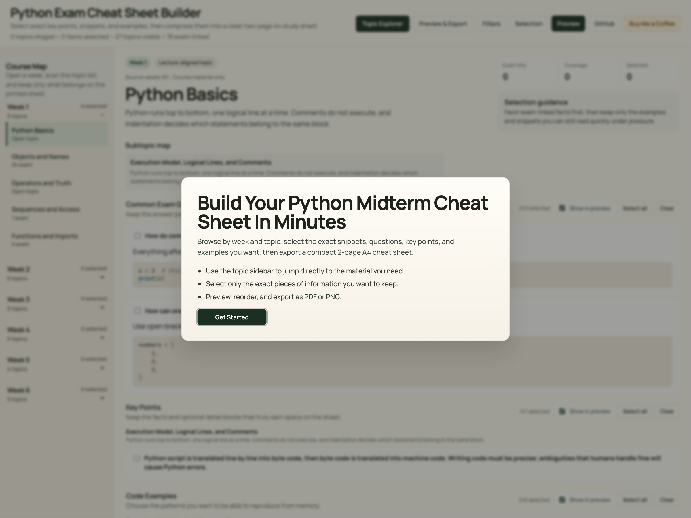
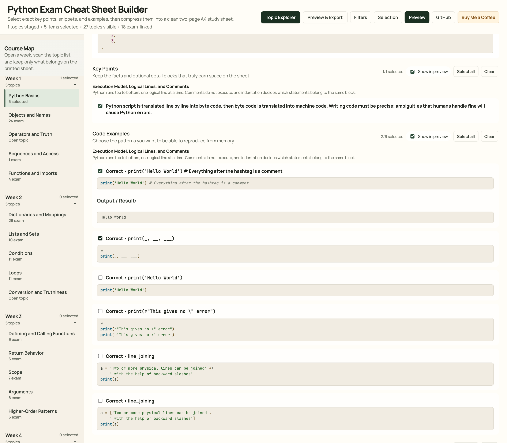
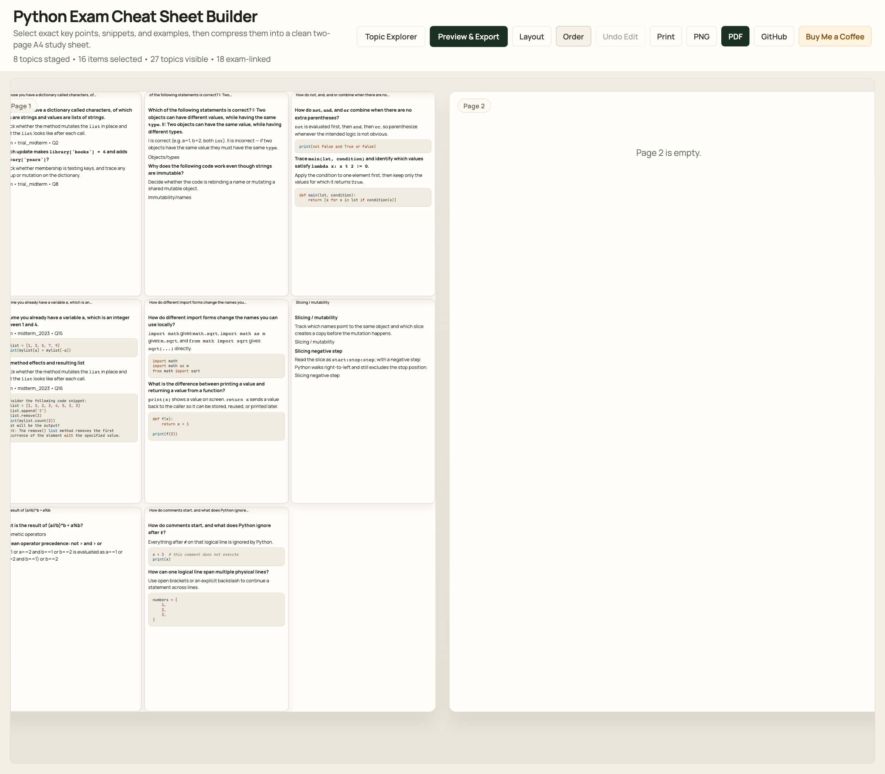

# Python Exam Cheat Sheet Builder

Build a clean, personalized Python exam cheat sheet from the course snippets that actually matter.

This app is made for students. You open a topic, browse its subtopics, tick the exact snippet pieces you want, and the app turns your selections into a compact two-page A4 sheet you can print or export.

The website now loads from the new Markdown-first snippet bank in [`new_database/`](new_database), using a build-generated frontend bundle at [`new_database/exports/frontend_bundle.json`](new_database/exports/frontend_bundle.json).

Right now the app includes:

- `8` top-level topics
- `20` subtopics
- `46` snippets
- `134` individually selectable markdown-backed pieces
- built-in preview, edit, undo, print, PNG, and PDF export tools

## What You Can Do

- browse topics and subtopics in the sidebar
- filter by `course_phase` and `recurrence_level`
- search by titles, summaries, keywords, and trap metadata
- choose exact snippet pieces instead of taking whole topics
- preview your sheet on two A4 pages before exporting
- drag, resize, lock, edit, or delete cards in the preview
- keep your progress in the browser so you can come back later

## How It Works

1. Open the app and click `Get Started`.
2. Use the left sidebar to jump to a topic.
3. Scan subtopics, then tick the exact snippet pieces you want to keep.
4. Open `Preview & Export` to see your cheat sheet.
5. Rearrange or edit cards until everything fits the way you want.
6. Export as `PDF`, `PNG`, or use `Print`.

## Screenshots

### First Open

The app starts with a short intro so you know the flow straight away.



### Picking What To Keep

You do not have to accept an entire topic. Select only the exact facts and examples you want on your sheet.



### Previewing The Final Sheet

Once you have picked enough material, the app builds a printable two-page layout that you can tweak before exporting.



## Quick Tips

- Start with the signature and very-common snippets first if you are short on time.
- Keep only what you would genuinely want to read during revision or right before the exam.
- Use the preview early instead of waiting until the end.
- If a card is in the right place, lock it so you do not move it by accident.

## Run It Locally

This is a static website, so you do not need a backend or a big setup.

```bash
python3 scripts/build_frontend_bundle.py
python3 -m http.server 8000
```

Then open [http://localhost:8000](http://localhost:8000).

## Course Materials

Official course files are still kept at their canonical paths under `materials/`, but there is now also a cleaner week-ordered view under [materials/by_week](materials/by_week) for easier browsing.

## Support This Project

This project was built by one student, and the AI agents/tools used to build it cost real money.

If it saved you time or stress, consider buying me a coffee as a thank-you:

[Buy me a coffee](https://buymeacoffee.com/caspersimon)
